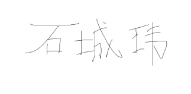
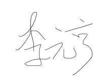
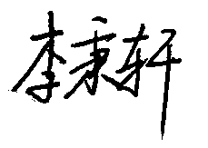
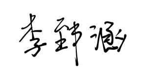

# AI协作契约

**团队名称：** awencat 
**日期：** 2026年4月11日

---

## 第一条：AI使用原则

- AI是工具，工程师是责任主体。
- 所有AI输出必须经过人工审查后才能合入项目。

---

## 第二条：AI使用范围

### 允许使用AI的场景：
- 代码补全、函数生成（如Copilot、Cursor）
- 编写注释、文档、README
- 生成测试用例初稿
- 协助调试、解释错误信息
- 辅助需求分析、用例建模

### 禁止直接使用AI输出（需额外审查）的场景：
- 核心业务逻辑代码
- 数据库设计、接口设计
- 安全相关代码（如权限校验、输入过滤）
- CI/CD脚本、部署配置

### 完全禁止使用AI的场景：
- 绕过代码审查或团队讨论直接合入
- 生成团队决策（如角色分工、架构选型）
- 替代人工撰写反思日志中的反思内容

---

## 第三条：过程记录要求

- 所有与AI的交互Prompt必须保留日志。
- Git commit message必须标注`[AI-assisted]`或`[Human-written]`。
- 每阶段填写《AI协作反思日志》。

---

## 第四条：代码合入规则

- AI生成的代码必须通过至少一名团队成员的Code Review。
- 每位成员每个编码阶段至少有2个完全手写的核心函数。

---

## 第五条：违约处理

- 责任人24小时内补充缺失内容（Prompt日志或commit标注），并在群里说明情况。
- 责任人需补写一份简短的AI使用反思（300字左右）。
- AI代码未经审查直接合入的，由该代码提交者负责回退或修改，并由至少一名其他成员重新审查。

---

## 全体成员签名

