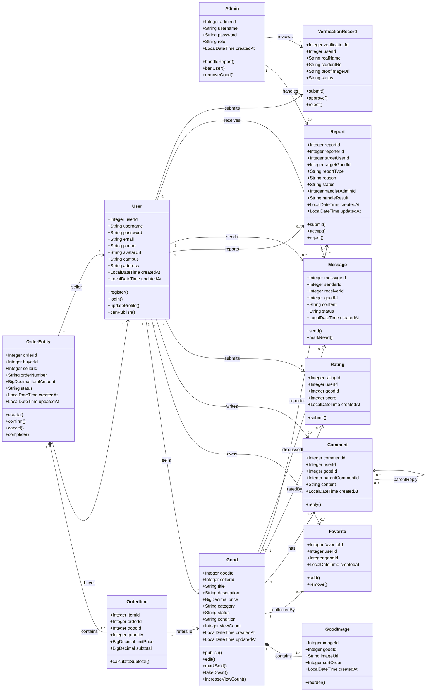

# 校园二手交易平台类图设计

## 1. 类图

## 2. 关键属性说明

| 类 | 职责 | 设计说明 |
| --- | --- | --- |
| `User` | 保存平台用户资料、联系方式、校区与登录凭据 | 密码只保存哈希值，不在响应中返回；后续应增加认证状态、信用分、封禁状态字段 |
| `VerificationRecord` | 保存实名或学生身份认证申请 | 从 `User` 拆分，避免用户类承担审核流程职责 |
| `Good` | 表示一条二手商品发布信息 | 商品状态建议收敛为枚举或状态策略，避免散落字符串 |
| `GoodImage` | 管理商品图片及排序 | 与 `Good` 组合关系，商品删除时图片记录应随之清理 |
| `Message` | 支持买卖双方围绕商品私信沟通 | 属于 P1 Must 需求，当前代码未实现，类图先预留边界 |
| `OrderEntity` | 记录交易主单、买家、卖家、金额与状态 | 只记录平台内交易状态，不引入线上支付 |
| `OrderItem` | 记录订单中的商品明细 | 与 `OrderEntity` 组合，支持后续一个订单多商品扩展 |
| `Rating` | 记录交易评价分数 | 后续可扩展评价文本和被评价用户字段，以支持双向评价 |
| `Report` | 记录举报对象、原因、处理状态与处理结果 | 同时支持举报用户与举报商品 |
| `Admin` | 处理举报、认证审核、违规账号治理 | 不直接承担普通用户业务逻辑 |
| `BaseCrudController<T>` | 复用通用 CRUD、分页、搜索、输入清洗流程 | 用泛型和模板方法减少重复控制器代码 |
| `UserServiceImpl` | 实现注册、登录、用户数据标准化与密码哈希 | 依赖 `PasswordEncoder` 抽象，避免直接绑定具体哈希算法 |
| `InputSanitizer` | 集中处理输入清洗和安全标识符检查 | 防止清洗逻辑散落到各 Controller |
| `ApiResponse<T>` | 统一 API 响应结构 | 成功和失败响应格式一致 |

## 3. 类关系说明

| 关系 | 类 | 类型 | 说明 |
| --- | --- | --- | --- |
| 用户发布商品 | `User` 到 `Good` | 关联，一对多 | 一个卖家可发布多个商品，一个商品只属于一个卖家 |
| 商品包含图片 | `Good` 到 `GoodImage` | 组合，一对多 | 图片依附于商品生命周期 |
| 用户收藏商品 | `User`、`Good`、`Favorite` | 关联类 | `Favorite` 连接用户和商品，避免多对多直接耦合 |
| 用户评论商品 | `User`、`Good`、`Comment` | 关联 | 评论属于某用户和某商品，可通过 `parentCommentId` 形成回复 |
| 买卖双方生成订单 | `User` 到 `OrderEntity` | 双向角色关联 | 一个订单同时关联买家和卖家 |
| 订单包含明细 | `OrderEntity` 到 `OrderItem` | 组合，一对多 | 明细不能脱离订单独立存在 |
| 订单明细指向商品 | `OrderItem` 到 `Good` | 关联 | 保留成交商品记录 |
| 用户评价商品 | `User`、`Good`、`Rating` | 关联类 | 每条评价对应一个用户和一个商品 |
| 用户提交举报 | `User` 到 `Report` | 关联，一对多 | 举报人是普通用户 |
| 管理员处理举报 | `Admin` 到 `Report` | 关联，一对多 | 管理员写入处理结果 |
| 用户提交认证 | `User` 到 `VerificationRecord` | 关联，一对多 | 支持被驳回后再次提交 |
| 管理员审核认证 | `Admin` 到 `VerificationRecord` | 关联，一对多 | 与举报处理流程分离 |

## 4. SOLID 检查清单

| SOLID 原则 | 检查问题 | AI 原始设计是否违反 | 违反说明 | 修正方案 |
| --- | --- | --- | --- | --- |
| S 单一职责 | 有没有类承担过多职责？ | 是 | 初稿把注册、登录、认证审核、信用分计算都放进 `UserService`，导致服务类过重 | 拆分 `AuthService`、`VerificationService`、`CreditService`；当前代码中先保留 `UserService` 登录注册，类图明确后续边界 |
| O 开闭原则 | 新增需求类型是否需要修改现有代码？ | 是 | 商品状态、订单状态、举报处理方式用字符串散落，新增状态需要修改多处判断 | 引入状态枚举和 `ReportHandleStrategy`、`OrderStatusPolicy`，新增处理方式通过新增策略类扩展 |
| L 里氏替换 | 子类是否可以替换父类使用？ | 否 | `UserController`、`GoodController` 等继承 `BaseCrudController<T>`，没有收紧父类前置条件 | 子类只注入具体 Service 和 ID 字段，保持通用 CRUD 行为一致 |
| I 接口隔离 | 有没有接口太胖，包含不需要的方法？ | 部分是 | MyBatis-Plus `IService` 能力较宽，所有服务默认暴露完整 CRUD | 对业务层新增细粒度接口，如 `AuthService`、`GoodsQueryService`、`ReportReviewService`，Controller 只依赖所需能力 |
| D 依赖倒转 | 高层模块是否直接依赖低层具体实现？ | 否 | `AuthController` 依赖 `UserService` 接口，`UserServiceImpl` 依赖 `PasswordEncoder` 抽象 | 继续保持 Controller 到 Service 接口、Service 到 Mapper 抽象的依赖方向 |
