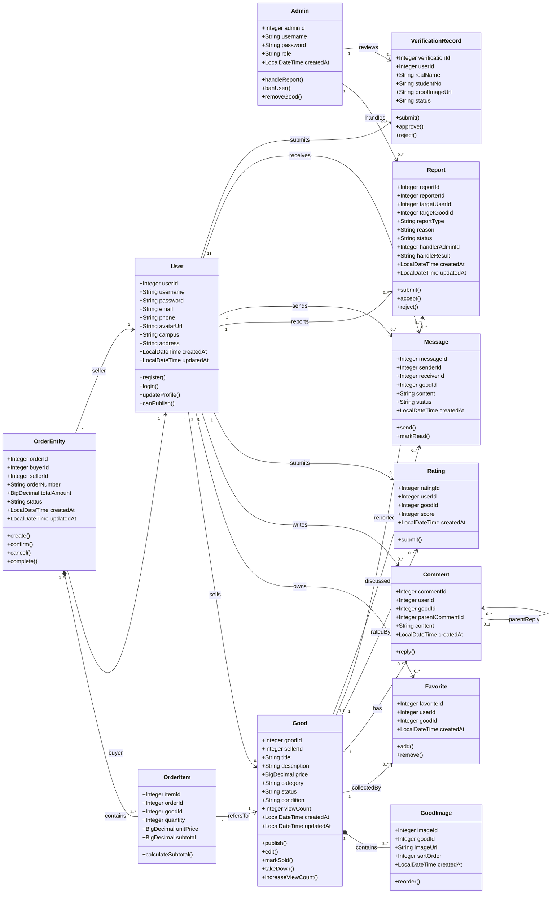

# 校园二手交易平台 — 详细设计文档

> **版本**：v1.0  
> **日期**：2026-05-15  
> **阶段**：Phase 3 — 详细设计  
> **仓库**：[SE2_NJU_Market](https://github.com/)  

---

## 目录

- [1. 文档概述](#1-文档概述)
- [2. 系统架构设计](#2-系统架构设计)
  - [2.1 架构风格](#21-架构风格)
  - [2.2 技术栈](#22-技术栈)
  - [2.3 分层架构](#23-分层架构)
  - [2.4 模块划分](#24-模块划分)
- [3. 类图设计](#3-类图设计)
  - [3.1 UML 类图](#31-uml-类图)
  - [3.2 关键类说明](#32-关键类说明)
  - [3.3 类关系说明](#33-类关系说明)
  - [3.4 SOLID 原则检查](#34-solid-原则检查)
- [4. 数据库设计](#4-数据库设计)
  - [4.1 ER 图](#41-er-图)
  - [4.2 表结构定义（DDL）](#42-表结构定义ddl)
  - [4.3 索引设计](#43-索引设计)
  - [4.4 数据字典](#44-数据字典)
  - [4.5 种子数据](#45-种子数据)
- [5. 接口 API 设计](#5-接口-api-设计)
  - [5.1 通用规范](#51-通用规范)
  - [5.2 用户认证接口](#52-用户认证接口)
  - [5.3 商品接口](#53-商品接口)
  - [5.4 订单接口](#54-订单接口)
  - [5.5 评价接口](#55-评价接口)
  - [5.6 通用 CRUD 接口](#56-通用-crud-接口)
- [6. 安全设计](#6-安全设计)
  - [6.1 密码安全](#61-密码安全)
  - [6.2 输入安全](#62-输入安全)
  - [6.3 隐私保护](#63-隐私保护)
  - [6.4 后续安全增强](#64-后续安全增强)
- [7. 前端设计](#7-前端设计)
  - [7.1 前端技术栈](#71-前端技术栈)
  - [7.2 前端架构](#72-前端架构)
  - [7.3 路由设计](#73-路由设计)
  - [7.4 组件树](#74-组件树)
  - [7.5 状态管理](#75-状态管理)
- [8. 项目结构](#8-项目结构)

---

## 1. 文档概述

本文档是校园二手交易平台（NJU Market）的**详细设计文档**，整合了 Phase 3 阶段的类图设计、数据库设计、API 接口设计、安全设计和前端设计等内容。

### 1.1 设计目标

本平台旨在为校内学生提供一个便捷的二手商品交易平台，支持用户注册登录、商品发布浏览、订单交易、评价评论、收藏关注、举报管理等功能。

### 1.2 参考文档

| 文档 | 路径 | 说明 |
|------|------|------|
| 需求规格说明书 | `docs/p1/需求规格说明书.md` | 功能需求与非功能需求 |
| 用户故事 | `docs/p1/用户故事.md` | 用户故事与验收标准 |
| 系统架构文档 | `docs/p2/系统架构文档.md` | 架构风格与技术选型 |
| ER 图 | `docs/P3/ER图.png` | 数据库实体关系图 |
| 数据库设计审查报告 | `docs/P3/数据库设计审查报告.md` | 数据类型、索引、隐私审查 |

---

## 2. 系统架构设计

### 2.1 架构风格

**前后端分离 + 分层架构 + 模块化单体**

```
┌──────────────────────────────────────────────────────┐
│                    前端 (Vue 3)                        │
│              Element Plus + Vue Router                │
├──────────────────────────────────────────────────────┤
│                 HTTP/REST API (JSON)                  │
├──────────────────────────────────────────────────────┤
│                Spring Boot 3.3.5 (后端)               │
│  ┌────────────────────────────────────────────────┐  │
│  │  Controller 层 (12 个)                          │  │
│  │  AuthController | UserController | GoodController│  │
│  │  OrderEntityController | ... | BaseCrudController│ │
│  ├────────────────────────────────────────────────┤  │
│  │  Service 层 (10 个接口 + 10 个实现)              │  │
│  │  UserServiceImpl (含BCrypt加密/头像上传)         │  │
│  ├────────────────────────────────────────────────┤  │
│  │  Mapper 层 (10 个 MyBatis Plus BaseMapper)      │  │
│  │  UserMapper | GoodMapper | OrderMapper | ...    │  │
│  ├────────────────────────────────────────────────┤  │
│  │  Common: ApiResponse | InputSanitizer | DTO    │  │
│  └────────────────────────────────────────────────┘  │
├──────────────────────────────────────────────────────┤
│               MySQL 8.0.32 (nju_market)               │
│                      10 张表                           │
└──────────────────────────────────────────────────────┘
```

### 2.2 技术栈

| 层次 | 技术 | 版本 | 用途 |
|------|------|------|------|
| **后端框架** | Spring Boot | 3.3.5 | 应用框架 |
| **语言** | Java | 17 | 开发语言 |
| **ORM** | MyBatis Plus | 3.5.7 | 数据访问 |
| **数据库** | MySQL | 8.0.32 | 数据持久化 |
| **密码加密** | BCrypt (Spring Security Crypto) | - | 密码哈希 |
| **代码简化** | Lombok | 1.18.30 | 减少样板代码 |
| **参数校验** | Jakarta Validation | - | 请求参数校验 |
| **API 文档** | Swagger (spring4all) | 1.5.1 | 接口文档 |
| **前端框架** | Vue.js | 3.5.32 | UI 框架 |
| **构建工具** | Vite | 8.0.4 | 前端构建 |
| **UI 组件库** | Element Plus | 2.13.7 | UI 组件 |
| **路由** | Vue Router | 4.6.4 | 前端路由 |
| **包管理** | Maven / npm | - | 依赖管理 |

### 2.3 分层架构

#### 后端分层

| 层 | 包路径 | 职责 | 关键类 |
|----|--------|------|--------|
| **Controller** | `controller/` | 接收 HTTP 请求，参数校验，调用 Service，返回 ApiResponse | `BaseCrudController<T>`, `AuthController` |
| **Service** | `service/` + `service/impl/` | 业务逻辑处理，事务管理，数据清洗 | `UserServiceImpl`, `*ServiceImpl` |
| **Mapper** | `mapper/` | 数据库访问，继承 MyBatis Plus `BaseMapper<T>` | `UserMapper`, `GoodMapper` |
| **Entity** | `entity/` | 数据库表映射，使用 `@TableName` 和 Lombok | `User`, `Good`, `OrderEntity` |
| **Common** | `common/` / `util/` / `config/` | 公共响应、输入清洗、配置 | `ApiResponse`, `InputSanitizer`, `SecurityConfig` |

**基类复用设计**：`BaseCrudController<T>` 提供通用 CRUD 端点模板，所有子 Controller 只需注入具体 Service 即可获得完整的增删改查 + 分页 + 搜索能力。这是模板方法模式的体现。

#### 前端分层

| 层 | 路径 | 职责 |
|----|------|------|
| **视图组件** | `src/components/` | 页面级和功能级 Vue 组件 |
| **路由** | `src/router/index.js` | 前端路由配置，路径到组件的映射 |
| **API 封装** | `src/api.js` | 统一的 HTTP 请求封装，代理到后端 |
| **静态资源** | `src/assets/` | 图片、SVG 等静态资源 |

### 2.4 模块划分

系统划分为 **8 个业务模块**：

| 序号 | 模块 | 核心实体 | 主要功能 |
|:----:|------|----------|----------|
| 1 | **用户模块** | `User` | 注册、登录、个人资料管理、头像上传 |
| 2 | **商品模块** | `Good`, `GoodImage` | 商品 CRUD、搜索、分类筛选、图片管理 |
| 3 | **订单模块** | `OrderEntity`, `OrderItem` | 订单创建、状态流转、订单明细 |
| 4 | **评价模块** | `Rating` | 评分提交、统计分析 |
| 5 | **评论模块** | `Comment` | 评论发布、嵌套回复（`parent_comment_id`） |
| 6 | **收藏模块** | `Favorite` | 收藏/取消收藏 |
| 7 | **举报模块** | `Report` | 举报商品/用户、管理员处理 |
| 8 | **管理模块** | `Admin` | 管理员登录、举报处理、系统治理 |

---

## 3. 类图设计

### 3.1 UML 类图



### 3.2 关键类说明

| 类 | 职责 | 设计说明 |
| --- | --- | --- |
| `User` | 保存平台用户资料、联系方式、校区与登录凭据 | 密码只保存哈希值（`@JsonIgnore` 屏蔽序列化）；后续应增加认证状态、信用分、封禁状态字段 |
| `Admin` | 处理举报、认证审核、违规账号治理 | 不直接承担普通用户业务逻辑；角色枚举为 `SUPER_ADMIN` / `CONTENT_ADMIN` |
| `Good` | 表示一条二手商品发布信息 | `price` 使用 `BigDecimal` 保证精度；状态建议收敛为枚举 |
| `GoodImage` | 管理商品图片及排序 | 与 `Good` 是组合关系（`*--`），商品删除时图片应级联删除 |
| `Favorite` | 用户收藏商品的关联记录 | 作为关联类连接 `User` 和 `Good`，避免多对多直接耦合；应设置 `(user_id, good_id)` 唯一约束 |
| `Comment` | 商品评论，支持嵌套回复 | 通过 `parent_comment_id` 自引用实现回复链 |
| `Message` | 买卖双方围绕商品的私信沟通 | 属于 P1 Must 需求，当前代码未实现，类图预留边界；status: `UNREAD`/`READ` |
| `OrderEntity` | 记录交易主单、买家、卖家、金额与状态 | 类名用 `OrderEntity` 避免与 Java 关键字冲突；表名 `` `order` `` |
| `OrderItem` | 记录订单中的商品明细 | `subtotal` 冗余存储，避免每次计算（反范式设计） |
| `Rating` | 记录交易评分（1-5 分） | `(user_id, good_id)` 应有唯一约束防重复评分 |
| `Report` | 记录举报对象、原因、处理状态与处理结果 | 同时支持举报用户（`target_user_id`）与举报商品（`target_good_id`） |
| `VerificationRecord` | 保存实名或学生身份认证申请 | 从 `User` 拆分，避免用户类承担审核流程职责；当前代码未实现，类图预留 |
| `BaseCrudController<T>` | 复用通用 CRUD、分页、搜索、输入清洗流程 | 用泛型和模板方法减少重复控制器代码；子类注入 Service 和 ID 字段名 |
| `UserServiceImpl` | 实现注册、登录、用户数据标准化与密码哈希 | 依赖 `PasswordEncoder` 接口（DIP），不直接绑定具体哈希算法 |
| `InputSanitizer` | 集中处理输入清洗和安全标识符检查 | 防止清洗逻辑散落到各 Controller |
| `ApiResponse<T>` | 统一 API 响应结构 | `{ success, message, data }` 三元组，成功和失败响应格式一致 |

### 3.3 类关系说明

| 关系 | 涉及类 | 类型 | 说明 |
| --- | --- | --- | --- |
| 用户发布商品 | `User` → `Good` | 关联，一对多 | 一个卖家可发布多个商品，一个商品只属于一个卖家 |
| 商品包含图片 | `Good` → `GoodImage` | **组合**，一对多 | 图片依附于商品生命周期，删除商品时图片级联删除 |
| 用户收藏商品 | `User`–`Favorite`–`Good` | 关联类 | `Favorite` 消除 `User` 与 `Good` 的 M:N 直接耦合 |
| 用户评论商品 | `User` → `Comment` ← `Good` | 关联 | 评论属于某用户和某商品，支持嵌套回复 |
| 评论嵌套回复 | `Comment` → `Comment` | 自关联 | `parent_comment_id` 递归引用 |
| 买卖双方生成订单 | `User` → `OrderEntity` | 双向角色关联 | `buyer_id` 和 `seller_id` 分别指向 `User` |
| 订单包含明细 | `OrderEntity` → `OrderItem` | **组合**，一对多 | 明细不能脱离订单独立存在，删除订单级联删除明细 |
| 订单明细指向商品 | `OrderItem` → `Good` | 关联 | 保留成交商品快照 |
| 用户评价商品 | `User`–`Rating`–`Good` | 关联类 | 每条评价对应一个用户和一个商品 |
| 用户提交举报 | `User` → `Report` | 关联，一对多 | 举报人通过 `reporter_id` 关联 |
| 管理员处理举报 | `Admin` → `Report` | 关联，一对多 | 通过 `handler_admin_id` 写入处理结果 |
| 用户提交认证 | `User` → `VerificationRecord` | 关联，一对多 | 支持被驳回后再次提交 |
| 管理员审核认证 | `Admin` → `VerificationRecord` | 关联，一对多 | 与举报处理流程分离 |

### 3.4 SOLID 原则检查

| 原则 | 检查问题 | 是否违反 | 说明 | 修正方案 |
| --- | --- |:---:| --- | --- |
| **S** 单一职责 | 有没有类承担过多职责？ | ⚠️ | 初稿把注册、登录、认证审核、信用分计算都放进 `UserService`，导致服务类过重 | 拆分 `AuthService`、`VerificationService`、`CreditService`；当前代码先保留 `UserService` 登录注册 |
| **O** 开闭原则 | 新增类型是否需要修改现有代码？ | ⚠️ | 商品状态、订单状态、举报处理方式用字符串散落，新增状态需修改多处判断 | 引入状态枚举 + 策略模式（`ReportHandleStrategy`、`OrderStatusPolicy`） |
| **L** 里氏替换 | 子类是否可以替换父类使用？ | ✅ | `UserController`、`GoodController` 等继承 `BaseCrudController<T>`，子类只注入具体 Service 和 ID 字段，不破坏父类契约 | — |
| **I** 接口隔离 | 有没有接口太胖？ | ⚠️ | MyBatis-Plus `IService` 能力较宽，所有服务默认暴露完整 CRUD | 对业务层新增细粒度接口（`AuthService`、`GoodsQueryService`），Controller 只依赖所需能力 |
| **D** 依赖倒转 | 高层是否直接依赖低层实现？ | ✅ | `AuthController` → `UserService` 接口；`UserServiceImpl` → `PasswordEncoder` 抽象；依赖方向正确 | — |

---

## 4. 数据库设计

### 4.1 ER 图

数据库实体关系图详见 [ER图.png](./ER图.png)。

核心实体及其关系：
- **User** ──< **Good**（一对多：卖家发布商品）
- **User** ──< **OrderEntity**（一对多：买家/卖家）
- **User** ──< **Favorite**（一对多）──> **Good**（一对多）
- **User** ──< **Comment**（一对多）──> **Good**（一对多）
- **User** ──< **Rating**（一对多）──> **Good**（一对多）
- **User** ──< **Report**（一对多：举报人）
- **Admin** ──< **Report**（一对多：处理人）
- **Good** ──< **GoodImage**（组合，一对多）
- **OrderEntity** ──< **OrderItem**（组合，一对多）
- **Comment** ──< **Comment**（自引用：父评论）

### 4.2 表结构定义（DDL）

以下为审查修订后的数据库建表脚本（`[NEW]` / `[CHANGED]` 标记相对于原始 schema.sql 的变更）。

```sql
CREATE DATABASE IF NOT EXISTS nju_market DEFAULT CHARACTER SET utf8mb4 COLLATE utf8mb4_unicode_ci;
USE nju_market;

-- ==================== 用户表 ====================
CREATE TABLE IF NOT EXISTS `user` (
  user_id INT PRIMARY KEY AUTO_INCREMENT,
  username VARCHAR(100) NOT NULL,
  password VARCHAR(255) NOT NULL,
  email VARCHAR(255),                              -- [CHANGED] 120 → 255 避免截断
  phone VARCHAR(30),
  avatar_url VARCHAR(512),                          -- [CHANGED] 255 → 512 支持长签名URL
  campus VARCHAR(100),
  address VARCHAR(255),
  created_at TIMESTAMP DEFAULT CURRENT_TIMESTAMP,
  updated_at TIMESTAMP DEFAULT CURRENT_TIMESTAMP ON UPDATE CURRENT_TIMESTAMP,
  UNIQUE INDEX idx_user_username (username),        -- [NEW] 登录核心索引
  UNIQUE INDEX idx_user_email (email)               -- [NEW] 注册去重索引
);

-- ==================== 管理员表 ====================
CREATE TABLE IF NOT EXISTS admin (
  admin_id INT PRIMARY KEY AUTO_INCREMENT,
  username VARCHAR(100) NOT NULL,
  password VARCHAR(255) NOT NULL,
  role ENUM('SUPER_ADMIN', 'CONTENT_ADMIN'),        -- [CHANGED] VARCHAR → ENUM 类型约束
  created_at TIMESTAMP DEFAULT CURRENT_TIMESTAMP
);

-- ==================== 商品表 ====================
CREATE TABLE IF NOT EXISTS good (
  good_id INT PRIMARY KEY AUTO_INCREMENT,
  seller_id INT NOT NULL,
  title VARCHAR(150) NOT NULL,
  description TEXT,
  price DECIMAL(10, 2) NOT NULL,
  category ENUM('book','digital','daily','sports','other'),  -- [CHANGED]
  status ENUM('ON_SALE','SOLD','OFF_SHELF'),                  -- [CHANGED]
  `condition` ENUM('USED_GOOD','USED_FAIR','USED_POOR'),     -- [CHANGED]
  view_count INT DEFAULT 0,
  created_at TIMESTAMP DEFAULT CURRENT_TIMESTAMP,
  updated_at TIMESTAMP DEFAULT CURRENT_TIMESTAMP ON UPDATE CURRENT_TIMESTAMP,
  CONSTRAINT fk_good_seller FOREIGN KEY (seller_id) REFERENCES `user` (user_id),
  INDEX idx_good_category_status (category, status),          -- [NEW] 分类+状态复合索引
  INDEX idx_good_status_created (status, created_at)          -- [NEW] 最新在售商品索引
);

-- ==================== 订单表 ====================
CREATE TABLE IF NOT EXISTS `order` (
  order_id INT PRIMARY KEY AUTO_INCREMENT,
  buyer_id INT NOT NULL,
  seller_id INT NOT NULL,
  order_number VARCHAR(100) NOT NULL UNIQUE,
  total_amount DECIMAL(10, 2) NOT NULL,
  status ENUM('PENDING','COMPLETED','CANCELLED'),             -- [CHANGED]
  created_at TIMESTAMP DEFAULT CURRENT_TIMESTAMP,
  updated_at TIMESTAMP DEFAULT CURRENT_TIMESTAMP ON UPDATE CURRENT_TIMESTAMP,
  CONSTRAINT fk_order_buyer FOREIGN KEY (buyer_id) REFERENCES `user` (user_id),
  CONSTRAINT fk_order_seller FOREIGN KEY (seller_id) REFERENCES `user` (user_id),
  INDEX idx_order_buyer_status (buyer_id, status),            -- [NEW]
  INDEX idx_order_seller_status (seller_id, status)           -- [NEW]
);

-- ==================== 举报表 ====================
CREATE TABLE IF NOT EXISTS report (
  report_id INT PRIMARY KEY AUTO_INCREMENT,
  reporter_id INT NOT NULL,
  target_user_id INT,
  target_good_id INT,
  report_type ENUM('USER','GOOD'),                            -- [CHANGED]
  reason TEXT,                                                 -- [CHANGED] VARCHAR → TEXT 支持长文本
  status ENUM('PROCESSING','RESOLVED','REJECTED'),            -- [CHANGED]
  handler_admin_id INT,
  handle_result TEXT,                                          -- [CHANGED]
  created_at TIMESTAMP DEFAULT CURRENT_TIMESTAMP,
  updated_at TIMESTAMP DEFAULT CURRENT_TIMESTAMP ON UPDATE CURRENT_TIMESTAMP,
  CONSTRAINT fk_report_reporter FOREIGN KEY (reporter_id) REFERENCES `user` (user_id),
  CONSTRAINT fk_report_target_user FOREIGN KEY (target_user_id) REFERENCES `user` (user_id),
  CONSTRAINT fk_report_target_good FOREIGN KEY (target_good_id) REFERENCES good (good_id),
  CONSTRAINT fk_report_admin FOREIGN KEY (handler_admin_id) REFERENCES admin (admin_id),
  INDEX idx_report_status_created (status, created_at)         -- [NEW]
);

-- ==================== 评论表 ====================
CREATE TABLE IF NOT EXISTS comment (
  comment_id INT PRIMARY KEY AUTO_INCREMENT,
  user_id INT NOT NULL,
  good_id INT NOT NULL,
  parent_comment_id INT,
  content TEXT NOT NULL,                                       -- [CHANGED] VARCHAR(500) → TEXT
  created_at TIMESTAMP DEFAULT CURRENT_TIMESTAMP,
  CONSTRAINT fk_comment_user FOREIGN KEY (user_id) REFERENCES `user` (user_id),
  CONSTRAINT fk_comment_good FOREIGN KEY (good_id) REFERENCES good (good_id),
  CONSTRAINT fk_comment_parent FOREIGN KEY (parent_comment_id) REFERENCES comment (comment_id),
  INDEX idx_comment_good_created (good_id, created_at)         -- [NEW]
);

-- ==================== 评分表 ====================
CREATE TABLE IF NOT EXISTS rating (
  rating_id INT PRIMARY KEY AUTO_INCREMENT,
  user_id INT NOT NULL,
  good_id INT NOT NULL,
  score INT NOT NULL CHECK (score BETWEEN 1 AND 5),            -- [NEW] CHECK约束
  created_at TIMESTAMP DEFAULT CURRENT_TIMESTAMP,
  CONSTRAINT fk_rating_user FOREIGN KEY (user_id) REFERENCES `user` (user_id),
  CONSTRAINT fk_rating_good FOREIGN KEY (good_id) REFERENCES good (good_id),
  UNIQUE INDEX idx_rating_user_good (user_id, good_id)         -- [NEW] 防重复评分
);

-- ==================== 收藏表 ====================
CREATE TABLE IF NOT EXISTS favorite (
  favorite_id INT PRIMARY KEY AUTO_INCREMENT,
  user_id INT NOT NULL,
  good_id INT NOT NULL,
  created_at TIMESTAMP DEFAULT CURRENT_TIMESTAMP,
  CONSTRAINT fk_favorite_user FOREIGN KEY (user_id) REFERENCES `user` (user_id),
  CONSTRAINT fk_favorite_good FOREIGN KEY (good_id) REFERENCES good (good_id),
  UNIQUE INDEX idx_favorite_user_good (user_id, good_id)       -- [NEW] 防重复收藏
);

-- ==================== 商品图片表 ====================
CREATE TABLE IF NOT EXISTS good_image (
  image_id INT PRIMARY KEY AUTO_INCREMENT,
  good_id INT NOT NULL,
  image_url VARCHAR(512) NOT NULL,                             -- [CHANGED] 255 → 512
  sort_order INT DEFAULT 0,
  created_at TIMESTAMP DEFAULT CURRENT_TIMESTAMP,
  CONSTRAINT fk_good_image_good FOREIGN KEY (good_id)
      REFERENCES good (good_id) ON DELETE CASCADE              -- [CHANGED] 级联删除
);

-- ==================== 订单明细表 ====================
CREATE TABLE IF NOT EXISTS order_item (
  item_id INT PRIMARY KEY AUTO_INCREMENT,
  order_id INT NOT NULL,
  good_id INT NOT NULL,
  quantity INT NOT NULL DEFAULT 1,
  unit_price DECIMAL(10, 2) NOT NULL,
  subtotal DECIMAL(10, 2) NOT NULL,
  CONSTRAINT fk_order_item_order FOREIGN KEY (order_id)
      REFERENCES `order` (order_id) ON DELETE CASCADE,         -- [CHANGED] 级联删除
  CONSTRAINT fk_order_item_good FOREIGN KEY (good_id) REFERENCES good (good_id)
);
```

### 4.3 索引设计

#### 当前索引状况

| 索引来源 | 覆盖字段 | 说明 |
|----------|----------|------|
| PRIMARY KEY（全部表） | 各自 `*_id` | 聚簇索引 |
| FOREIGN KEY（InnoDB 自动） | 所有 FK 字段 | 非聚簇索引 |
| `order_number` UNIQUE | `order.order_number` | 唯一索引 |
| **[NEW]** `idx_user_username` UNIQUE | `user.username` | 登录查询核心 |
| **[NEW]** `idx_user_email` UNIQUE | `user.email` | 注册去重 |
| **[NEW]** `idx_good_category_status` | `good(category, status)` | 分类浏览 |
| **[NEW]** `idx_good_status_created` | `good(status, created_at)` | 最新商品 |
| **[NEW]** `idx_order_buyer_status` | `order(buyer_id, status)` | 买家订单 |
| **[NEW]** `idx_order_seller_status` | `order(seller_id, status)` | 卖家订单 |
| **[NEW]** `idx_comment_good_created` | `comment(good_id, created_at)` | 评论列表 |
| **[NEW]** `idx_report_status_created` | `report(status, created_at)` | 举报管理 |
| **[NEW]** `idx_rating_user_good` UNIQUE | `rating(user_id, good_id)` | 防重复评分 |
| **[NEW]** `idx_favorite_user_good` UNIQUE | `favorite(user_id, good_id)` | 防重复收藏 |

#### 索引设计原则

1. **最左前缀原则**：`(category, status)` 可覆盖单独查 `category` 的查询
2. **高选择性优先**：`username`、`email` 几乎唯一，适合建索引；`status` 选择性低（3-4 种），放在复合索引末尾
3. **覆盖索引**：高频查询尽量让索引覆盖所需字段，避免回表
4. **避免过度索引**：每个索引都会增加写入成本，需权衡读写比例

### 4.4 数据字典

#### user 表

| 字段 | 类型 | 约束 | 说明 |
|------|------|------|------|
| `user_id` | INT | PK, AUTO_INCREMENT | 用户 ID |
| `username` | VARCHAR(100) | NOT NULL, UNIQUE | 用户名 (3-20 位字母数字下划线) |
| `password` | VARCHAR(255) | NOT NULL | BCrypt 哈希值 |
| `email` | VARCHAR(255) | UNIQUE | 邮箱 |
| `phone` | VARCHAR(30) | | 手机号 |
| `avatar_url` | VARCHAR(512) | | 头像 URL |
| `campus` | VARCHAR(100) | | 校区 (Xianlin/Gulou/Pukou) |
| `address` | VARCHAR(255) | | 联系地址 |
| `created_at` | TIMESTAMP | DEFAULT NOW | 创建时间 |
| `updated_at` | TIMESTAMP | ON UPDATE NOW | 更新时间 |

#### good 表

| 字段 | 类型 | 约束 | 说明 |
|------|------|------|------|
| `good_id` | INT | PK, AUTO_INCREMENT | 商品 ID |
| `seller_id` | INT | NOT NULL, FK → user | 卖家用户 ID |
| `title` | VARCHAR(150) | NOT NULL | 商品标题 |
| `description` | TEXT | | 商品描述 |
| `price` | DECIMAL(10,2) | NOT NULL | 价格 |
| `category` | ENUM | | book / digital / daily / sports / other |
| `status` | ENUM | | ON_SALE / SOLD / OFF_SHELF |
| `condition` | ENUM | | USED_GOOD / USED_FAIR / USED_POOR |
| `view_count` | INT | DEFAULT 0 | 浏览次数 |
| `created_at` | TIMESTAMP | DEFAULT NOW | 发布时间 |
| `updated_at` | TIMESTAMP | ON UPDATE NOW | 更新时间 |

#### order 表

| 字段 | 类型 | 约束 | 说明 |
|------|------|------|------|
| `order_id` | INT | PK, AUTO_INCREMENT | 订单 ID |
| `buyer_id` | INT | NOT NULL, FK → user | 买家 ID |
| `seller_id` | INT | NOT NULL, FK → user | 卖家 ID |
| `order_number` | VARCHAR(100) | NOT NULL, UNIQUE | 订单编号 |
| `total_amount` | DECIMAL(10,2) | NOT NULL | 总金额 |
| `status` | ENUM | | PENDING / COMPLETED / CANCELLED |
| `created_at` | TIMESTAMP | DEFAULT NOW | 创建时间 |
| `updated_at` | TIMESTAMP | ON UPDATE NOW | 更新时间 |

#### 枚举值汇总

| 字段 | 所属表 | 枚举值 |
|------|--------|--------|
| `category` | good | `book`（教材）, `digital`（数码）, `daily`（日用）, `sports`（运动）, `other`（其他） |
| `status`（商品） | good | `ON_SALE`（在售）, `SOLD`（已售）, `OFF_SHELF`（下架） |
| `condition` | good | `USED_GOOD`（良品）, `USED_FAIR`（一般）, `USED_POOR`（较差） |
| `status`（订单） | order | `PENDING`（待处理）, `COMPLETED`（已完成）, `CANCELLED`（已取消） |
| `role` | admin | `SUPER_ADMIN`（超级管理员）, `CONTENT_ADMIN`（内容管理员） |
| `report_type` | report | `USER`（举报用户）, `GOOD`（举报商品） |
| `status`（举报） | report | `PROCESSING`（处理中）, `RESOLVED`（已解决）, `REJECTED`（已驳回） |

### 4.5 种子数据

种子数据位于 `docs/P3/data.sql` 和 `backend/src/main/resources/sql/data.sql`，包含：

| 表 | 数据量 | 说明 |
|----|:---:|------|
| `user` | 4 条 | alice / bob / charlie / diana |
| `admin` | 2 条 | root (SUPER_ADMIN) / auditor (CONTENT_ADMIN) |
| `good` | 4 条 | 高数教材 / 机械键盘 / 宿舍台灯 / 篮球 |
| `order` | 3 条 | PENDING / COMPLETED / CANCELLED 各一条 |
| `order_item` | 3 条 | 对应 3 个订单 |
| `comment` | 4 条 | 含 1 条回复链 |
| `rating` | 3 条 | 5 分 / 4 分 / 3 分 |
| `favorite` | 3 条 | 3 个不同的收藏关系 |
| `report` | 2 条 | PROCESSING / RESOLVED 各一条 |
| `good_image` | 4 条 | 4 张商品图片 |

> ⚠️ **重要提示**：种子数据中密码字段为明文 `'123456'`，与后端 BCrypt 加密不兼容。部署前需替换为 BCrypt 哈希值（如 `$2a$10$N9qo8uLOickgx2ZMRZoMyeIjZAgcfl7p92ldGxad68LJZdL17lhWy`）。

---

## 5. 接口 API 设计

### 5.1 通用规范

| 规范项 | 说明 |
|--------|------|
| **风格** | RESTful |
| **基础路径** | `/api` |
| **数据格式** | `application/json` |
| **字符编码** | `UTF-8` |
| **时间格式** | `yyyy-MM-dd HH:mm:ss` |

#### 通用响应格式

```json
// 成功
{
  "success": true,
  "message": "ok",
  "data": {}
}

// 失败
{
  "success": false,
  "message": "error message",
  "data": null,
  "code": "ERROR_CODE"
}
```

#### 错误码定义

| 错误码 | HTTP 状态码 | 含义 |
|--------|:---:|------|
| `SUCCESS` | 200 | 请求成功 |
| `BAD_REQUEST` | 400 | 请求参数错误 |
| `UNAUTHORIZED` | 401 | 未认证 |
| `FORBIDDEN` | 403 | 无权限 |
| `NOT_FOUND` | 404 | 资源不存在 |
| `CONFLICT` | 409 | 资源冲突（如用户名重复） |
| `VALIDATION_FAILED` | 422 | 业务校验失败 |
| `INTERNAL_ERROR` | 500 | 服务内部错误 |

### 5.2 用户认证接口

#### 5.2.1 用户注册

| 项目 | 说明 |
|------|------|
| **URL** | `POST /api/auth/register` |
| **认证** | 无需 |

**请求参数**：

| 参数名 | 类型 | 必填 | 说明 |
|--------|------|:---:|------|
| `username` | string | 是 | 3-20 位，仅允许字母数字下划线 |
| `password` | string | 是 | 6-64 位，后端 BCrypt 加密 |
| `email` | string | 是 | 邮箱 |
| `phone` | string | 否 | 手机号 |
| `campus` | string | 否 | 校区 |
| `address` | string | 否 | 联系地址 |

**成功响应** (200)：
```json
{
  "success": true,
  "message": "registered",
  "data": {
    "userId": 1,
    "username": "alice_01",
    "email": "alice@example.com",
    "campus": "Xianlin"
  }
}
```

#### 5.2.2 用户登录

| 项目 | 说明 |
|------|------|
| **URL** | `POST /api/auth/login` |
| **认证** | 无需 |

**请求参数**：

| 参数名 | 类型 | 必填 | 说明 |
|--------|------|:---:|------|
| `username` | string | 是 | 用户名 |
| `password` | string | 是 | 密码，与 BCrypt 哈希比对 |

**成功响应** (200)：
```json
{
  "success": true,
  "message": "logged in",
  "data": {
    "userId": 1,
    "username": "alice_01",
    "email": "alice@example.com",
    "campus": "Xianlin"
  }
}
```

### 5.3 商品接口

#### 5.3.1 发布商品

| 项目 | 说明 |
|------|------|
| **URL** | `POST /api/goods` |
| **认证** | 需登录 |

**请求参数**：

| 参数名 | 类型 | 必填 | 说明 |
|--------|------|:---:|------|
| `sellerId` | integer | 是 | 卖家 ID |
| `title` | string | 是 | 商品标题 |
| `description` | string | 否 | 描述 |
| `price` | number | 是 | 价格 (DECIMAL) |
| `category` | string | 否 | book/digital/daily/sports/other |
| `status` | string | 是 | ON_SALE |
| `condition` | string | 否 | USED_GOOD/USED_FAIR/USED_POOR |
| `viewCount` | integer | 否 | 默认 0 |

#### 5.3.2 浏览商品列表

| 项目 | 说明 |
|------|------|
| **URL** | `GET /api/goods` |
| **认证** | 可选 |

**查询参数**：

| 参数名 | 类型 | 必填 | 说明 |
|--------|------|:---:|------|
| `category` | string | 否 | 按分类筛选 |
| `status` | string | 否 | 按状态筛选 |
| `sellerId` | integer | 否 | 按卖家筛选 |
| `current` | integer | 否 | 页码 (从 1 开始) |
| `size` | integer | 否 | 每页大小 |

**分页响应**：
```json
{
  "success": true,
  "message": "ok",
  "data": {
    "records": [ { "goodId": 101, ... } ],
    "total": 1,
    "size": 10,
    "current": 1
  }
}
```

### 5.4 订单接口

#### 5.4.1 创建订单（接单）

| 项目 | 说明 |
|------|------|
| **URL** | `POST /api/orders` |
| **实现** | 事务封装（订单 + 订单明细同时创建） |

**请求参数**：

| 参数名 | 类型 | 必填 | 说明 |
|--------|------|:---:|------|
| `buyerId` | integer | 是 | 买家 ID |
| `sellerId` | integer | 是 | 卖家 ID |
| `orderNumber` | string | 是 | 订单编号（唯一） |
| `totalAmount` | number | 是 | 总金额 |
| `status` | string | 是 | PENDING |
| `items` | array | 是 | 订单明细列表 |

`items` 子项：

| 参数名 | 类型 | 必填 | 说明 |
|--------|------|:---:|------|
| `goodId` | integer | 是 | 商品 ID |
| `quantity` | integer | 是 | 数量 |
| `unitPrice` | number | 是 | 单价 |
| `subtotal` | number | 是 | 小计 |

#### 5.4.2 查看订单详情

| 项目 | 说明 |
|------|------|
| **URL** | `GET /api/orders/{orderId}` |
| **权限** | 仅买家/卖家/管理员 |

### 5.5 评价接口

#### 提交评价

| 项目 | 说明 |
|------|------|
| **URL** | `POST /api/ratings` |
| **参数** | `userId`, `goodId`, `score` (1-5) |

> 当前 `rating` 表仅支持评分（score），若后续需文字评价，建议在 `comment` 表或单独的评价内容表中实现。

### 5.6 通用 CRUD 接口

所有数据资源通过 `BaseCrudController<T>` 模板方法自动获得以下端点：

| 方法 | URL | 说明 |
|------|-----|------|
| `GET` | `/api/{resource}` | 列表查询（支持分页 + 条件筛选） |
| `POST` | `/api/{resource}/search` | 条件搜索（白名单校验字段名） |
| `GET` | `/api/{resource}/{id}` | 按 ID 查询 |
| `POST` | `/api/{resource}` | 新增（自动输入清洗） |
| `PUT` | `/api/{resource}/{id}` | 更新 |
| `DELETE` | `/api/{resource}/{id}` | 删除 |

**资源映射表**：

| 资源路径 | Controller | 实体 |
|----------|------------|------|
| `/api/goods` | GoodController | Good |
| `/api/orders` | OrderEntityController | OrderEntity |
| `/api/order-items` | OrderItemController | OrderItem |
| `/api/comments` | CommentController | Comment |
| `/api/ratings` | RatingController | Rating |
| `/api/favorites` | FavoriteController | Favorite |
| `/api/reports` | ReportController | Report |
| `/api/good-images` | GoodImageController | GoodImage |
| `/api/users` | UserController | User |
| `/api/admins` | AdminController | Admin |

---

## 6. 安全设计

### 6.1 密码安全

| 层面 | 实现 | 状态 |
|------|------|:---:|
| **存储** | BCrypt 哈希 (`BCryptPasswordEncoder`)，存储在 `password VARCHAR(255)` | ✅ |
| **传输** | 前端明文发送至 HTTPS/TLS 端点，后端立即 BCrypt 哈希后入库 | ✅ |
| **响应** | `User.java` 的 `password` 标注 `@JsonIgnore`，不会序列化到任何 JSON 响应 | ✅ |
| **验证** | `UserServiceImpl.login()` 使用 `passwordEncoder.matches()` 进行恒定时间比较 | ✅ |
| **防重复加密** | `normalizeUser()` 检测 `$2` 前缀（BCrypt 标准前缀），跳过已加密密码 | ✅ |
| **种子数据** | ⚠️ 当前 `data.sql` 存明文 `'123456'`，需替换为 BCrypt 哈希 | ❌ |
| **Admin 加密** | ⚠️ `AdminServiceImpl` 空实现，未加密密码；`Admin.java` 无 `@JsonIgnore` | ❌ |

### 6.2 输入安全

| 措施 | 实现位置 | 说明 |
|------|----------|------|
| **XSS 防护** | `InputSanitizer.cleanPlainText()` | 移除 `<` `>` `"` `'` `` ` ``；检测 `script` 关键字直接抛异常 |
| **用户名白名单** | `InputSanitizer.ensureSafeIdentifier()` | 正则 `^[A-Za-z0-9_]{3,20}$` |
| **SQL 注入防护** | MyBatis Plus 参数化查询 | 所有查询使用 `?` 占位符，不拼接原始 SQL |
| **列名注入防护** | `BaseCrudController.search()` | 搜索字段做白名单校验，拒绝非实体字段 |
| **文件上传防护** | `UserServiceImpl.uploadAvatar()` | 仅允许 `jpg/jpeg/png/gif/webp`；校验文件魔术字；路径穿越检测 |
| **字段白名单** | `BaseCrudController` | 筛选字段与实体字段做白名单映射 |
| **参数校验** | Jakarta Validation | `@Valid` + `@NotBlank` / `@Size` / `@Email` 等 |

### 6.3 隐私保护

| 数据 | 保护策略 | 说明 |
|------|----------|------|
| **密码** | BCrypt 哈希 + `@JsonIgnore` | 从不以任何形式返回 |
| **手机号** | 建议 API 脱敏 `138****0001` | 当前明文存储，后续增加 `maskPhone()` 工具方法 |
| **邮箱** | 可选脱敏 | 当前明文存储，可接受 |
| **地址** | 仅交易双方可见 | 详情地址不公开给非交易相关用户 |
| **头像** | 可公开 | 无敏感信息 |

### 6.4 后续安全增强

| 建议 | 优先级 |
|------|:---:|
| 引入 JWT 或 Session 做登录态管理（当前无 token 机制） | 🔴 高 |
| Admin 密码增加 `@JsonIgnore` 和 BCrypt 加密 | 🔴 高 |
| 增加接口级别权限控制（买家/卖家/管理员角色区分） | 🔴 高 |
| 手机号 API 响应脱敏处理 | 🟡 中 |
| 增加请求频率限制（Rate Limiting）防暴力破解 | 🟡 中 |
| 增加操作审计日志 | 🟢 低 |

---

## 7. 前端设计

### 7.1 前端技术栈

| 技术 | 版本 | 用途 |
|------|------|------|
| Vue.js | 3.5.32 | 前端框架（Composition API） |
| Vite | 8.0.4 | 构建工具 |
| Element Plus | 2.13.7 | UI 组件库 |
| Vue Router | 4.6.4 | 前端路由 |
| Fetch API | 原生 | HTTP 请求 |

### 7.2 前端架构

```
src/
├── main.js                 # 入口：挂载 Vue、Element Plus、Router
├── App.vue                 # 根组件
├── api.js                  # API 封装层（统一 fetch、错误处理）
├── style.css               # 全局样式
├── assets/                 # 静态资源（图片、SVG）
├── components/
│   ├── login.vue           # 登录/注册页（双模式切换）
│   ├── Index.vue           # 布局容器（Header + router-view）
│   ├── HeaderR.vue         # 顶栏导航组件
│   ├── FrontPage.vue       # 首页（分类入口 + 最新商品）
│   ├── Homepage.vue        # 个人中心
│   ├── update.vue          # 修改资料 + 头像上传
│   ├── CrudDashboard.vue   # 数据控制台（全资源 CRUD）
│   ├── PlaceholderPage.vue # 占位页（未实现功能）
│   └── test.vue            # 测试组件
├── router/
│   └── index.js            # 路由配置
└── public/
    ├── favicon.svg
    └── icons.svg
```

### 7.3 路由设计

| 路径 | 组件 | 说明 |
|------|------|------|
| `/` | `login.vue` | 登录/注册页 |
| `/FrontPage` | `Index.vue` → `FrontPage.vue` | 首页（带导航栏） |
| `/HomePage` | `Homepage.vue` | 个人主页 |
| `/update` | `update.vue` | 修改个人资料 |
| `/CrudDashboard` | `Index.vue` → `CrudDashboard.vue` | 数据控制台 |
| `/DailyShop` | `Index.vue` → `PlaceholderPage.vue` | 日用品分类（占位） |
| `/BookShop` | `Index.vue` → `PlaceholderPage.vue` | 教材分类（占位） |
| `/DigitalShop` | `Index.vue` → `PlaceholderPage.vue` | 数码分类（占位） |
| `/MoeShop` | `Index.vue` → `PlaceholderPage.vue` | 萌宠分类（占位） |
| `/GoodsManager` | `Index.vue` → `PlaceholderPage.vue` | 商品管理（占位） |
| `/UserManager` | `Index.vue` → `PlaceholderPage.vue` | 用户管理（占位） |

### 7.4 组件树

```
App.vue
├── login.vue                          # 路由 /
│   ├── 登录表单 (el-form)
│   └── 注册表单 (el-form)
│
├── Index.vue                          # 路由 /FrontPage, /CrudDashboard, 等
│   ├── HeaderR.vue                    # 全局顶栏
│   │   ├── 导航菜单 (el-menu)
│   │   ├── 头像 + 用户名
│   │   └── 登出按钮
│   ├── <router-view>
│   │   ├── FrontPage.vue             # 首页
│   │   │   ├── 分类卡片区 (el-row > el-card)
│   │   │   └── 最新商品列表 (el-row > el-card)
│   │   ├── CrudDashboard.vue         # 数据控制台
│   │   │   ├── 资源选择器 (el-select)
│   │   │   ├── 数据表格 (el-table)
│   │   │   ├── 搜索表单 (el-form)
│   │   │   └── 新增/编辑对话框 (el-dialog)
│   │   └── PlaceholderPage.vue       # 占位
│
├── Homepage.vue                       # 路由 /HomePage
│   └── 用户信息卡片 (el-descriptions)
│
└── update.vue                         # 路由 /update
    ├── 修改资料表单 (el-form)
    └── 头像上传 (el-upload)
```

### 7.5 状态管理

当前未使用 Vuex/Pinia，采用 **localStorage + 组件间 props/emit** 的轻量方案：

| 状态 | 存储方式 | 说明 |
|------|----------|------|
| `currentUser` | `localStorage` | 登录后存储 `{ userId, username, email, avatarUrl, campus }` |
| 登录态判断 | 检查 `localStorage.currentUser` | 用于路由守卫和 Header 展示 |
| 资源列表/详情 | 组件内 `ref()` | 通过 `api.js` 从后端动态获取 |

---

## 8. 项目结构

### 8.1 仓库目录总览

```
SE2_NJU_Market/
├── README.md
├── .github/workflows/maven-publish.yml
├── docs/
│   ├── P0/                              # 项目启动
│   │   ├── AI协作契约.md
│   │   └── 团队章程.md
│   ├── p1/                              # 需求分析
│   │   ├── 需求规格说明书.md
│   │   ├── 用户故事.md
│   │   └── 三个用例详细描述.md
│   ├── p2/                              # 架构设计
│   │   ├── 系统架构文档.md
│   │   ├── ADR-001-架构风格选择.md
│   │   ├── ADR-002-技术栈选择.md
│   │   └── ADR-003-数据库设计决策.md
│   └── P3/                              # 详细设计
│       ├── 详细设计文档.md              ★ 本文档
│       ├── 类图设计.md
│       ├── 核心接口API规范.md
│       ├── 数据库设计审查报告.md
│       ├── data.sql
│       └── ER图.png
├── backend/                             # Spring Boot 后端
│   ├── pom.xml
│   └── src/main/
│       ├── java/com/marketback/main/
│       │   ├── DemoApplication.java
│       │   ├── common/ApiResponse.java
│       │   ├── config/                  # SecurityConfig, MybatisPlusConfig, ...
│       │   ├── controller/              # BaseCrudController, AuthController, ...
│       │   ├── dto/                     # RegisterRequest, LoginRequest, ...
│       │   ├── entity/                  # User, Good, OrderEntity, ...
│       │   ├── exception/               # GlobalExceptionHandler
│       │   ├── mapper/                  # UserMapper, GoodMapper, ...
│       │   ├── service/                 # UserService, ... + impl/
│       │   └── util/InputSanitizer.java
│       └── resources/
│           ├── application.yaml
│           └── sql/
│               ├── schema.sql
│               └── data.sql
└── frontend/                            # Vue 3 前端
    ├── package.json
    ├── vite.config.js
    ├── index.html
    └── src/
        ├── main.js
        ├── App.vue
        ├── api.js
        ├── style.css
        ├── assets/
        ├── components/                  # login.vue, Index.vue, FrontPage.vue, ...
        ├── router/index.js
        └── public/
```

### 8.2 后端配置文件

```yaml
# application.yaml
spring:
  application.name: nju-market
  datasource:
    driver-class-name: com.mysql.cj.jdbc.Driver
    url: jdbc:mysql://localhost:3306/nju_market?useUnicode=true&characterEncoding=UTF-8&serverTimezone=Asia/Shanghai
    username: root
    password: root

server:
  port: 8080

mybatis-plus:
  configuration:
    map-underscore-to-camel-case: true
  global-config:
    db-config:
      id-type: auto
```

### 8.3 构建与运行

```bash
# 后端
cd backend
./mvnw spring-boot:run         # 启动在 localhost:8080

# 前端
cd frontend
npm install
npm run dev                    # 启动在 localhost:5173，代理 API 到 8080
```

---

> **文档版本历史**  
> | 版本 | 日期 | 变更 |  
> |------|------|------|  
> | v1.0 | 2026-05-15 | 初始整合：类图 + 数据库 + API + 安全 + 前端 |